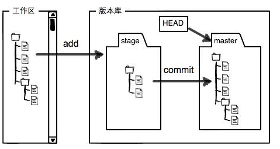
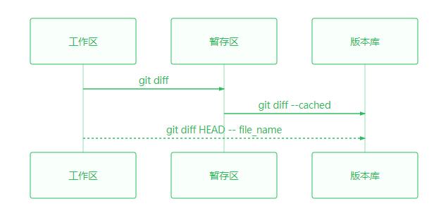
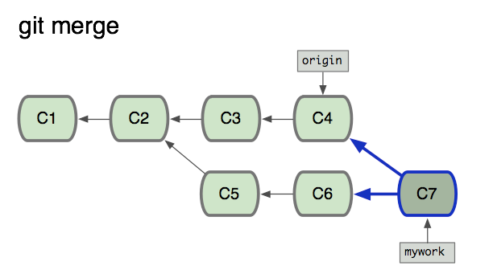
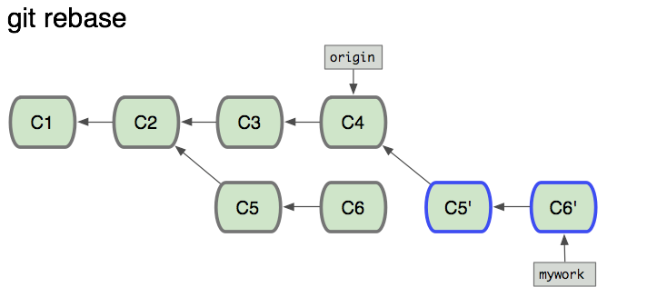

# Git 笔记
## 简介入门
---
**分布式版本控制与集中式版本控制的最大区别**  
> 集中式的版本控制，本地没有历史记录，完整的仓库只存在服务器上，如果服务器挂了就全都挂了，而分布式如果 github 挂了可以重建一个服务器，然后把任何一个人的仓库 clone 过去。`一句话总结：分布式版本控制的每个节点都是完整仓库`

### 安装 Git
* [Git 下载地址](https://git-for-windows.github.io/ )
* [Git User Manual](https://mirrors.edge.kernel.org/pub/software/scm/git/docs/user-manual.html)
* [Git 中文手册](https://git-scm.com/book/zh/v2)

下载并安装Git，安装完成后，还需要最后一步设置  
`Git Bash` 命令行输入：
```
$ git config --global user.name "Your Name"
$ git config --global user.email "email@example.com"
```

### 创建版本库并创建文件上传

1. 创建一个空目录
    ```cmd
    mkdir learngit
    cd learngit
    ```

2. git init 将目录变成 git 仓库目录
    ```cmd
    git init
    ```

3. 把文件添加到暂存区
    ```cmd
        echo "# learngit" >> README.md
        git add README.md
    ```

4. 把文件提交到版本库
    ```cmd
    git commit -m "first commit"
    ```
    - git commit
        > -m 后面是本次提交的说明，一次可以提交多个文件  
        **注意: **`git commit` 指定文件的时候会直接提交**工作区**的文件，不指 文件   的时候 提交的是**缓存区 `stage` 的所有文件**
        
        ```
        git commit readme.txt -m "balabala"
        ```
5. example
    ```
    cat>readme.txt<<EOF
    Git is a version control system.
    Git is free software. 
    EOF
    git add readme.txt
    git commit -m "wrote a readme file"
    ```

## 时光穿梭机
---
### 版本回退

```
git reset --hard commit_id
```

* `HEAD` 指向的版本就是当前版本，因此，Git 允许我们在版本的历史之间穿梭，使用命令 `git reset --hard commit_id`
    * Git的 `commit_d` (版本号)是一个十六进制的用 SHA1 计算出来的数字
    * 在 Git 中用 `HEAD` 表示当前版本，上一个版本就是 `HEAD^`，上一百个版本写成 `HEAD~100` 
    * 使用 `git reset --hard HEAD^` 命令退回上一个版本
* 穿梭前，用 `git log` 可以查看提交历史，以便确定要回退到哪个版本
    * 使用 `git log --pretty=oneline` 让记录单行显示
    * 使用 `git log` 或 `git reflog` 加 `file_name` 查看指定文件的历史
* 要重返未来，用 `git reflog` 查看命令历史，以便确定要回到未来的哪个版本
    * Git 提供一个命令 `git reflog` 来记录你的每一次命令，这样就可以找到所有版本的 `commit id`  

### 工作区和暂存区
* **工作区(Working Directory)**  
你在电脑里能看到的目录
* **版本库(Repository)**  
工作区有一个隐藏目录 `.git`，这个不算工作区，而是 Git 的版本库.我们可以称它为 *Repo*  
*Repo* 里存放了很多东西，其中最重要的就是暂存区 `stage` (或者叫 index )，还有 Git 为我们自动创建的第一个分支 (`Branch`) `master`；以及指向 `master` 的一个指针叫 `HEAD`   
  

- 前面讲了我们把文件往 `Git` 版本库里添加的时候，是分两步执行的：  
    - 第一步是用 `git add` 把文件添加进去，实际上就是把文件修改添加到**暂存区**；  
    - 第二步是用 `git commit` 提交更改，实际上就是把暂存区的所有内容**提交到当前分支**。  

### 查看修改内容
下面是关于 `git diff`的一些使用区别  
  
另外可以使用`git diff commit_id_1 commit_id_2`比较两个不同版本的区别  

`cat file_name`命令，其功能是显示在工作区、暂存区和分支里同名文档的**最新修改版本的内容**


### 撤销修改
* **场景1**：当你改乱了**工作区**某个文件的内容，想直接丢弃工作区的修改时，用命令`git checkout -- file_name`
    * 可以用`git checkout -- *`丢弃所有工作区文件的修改
* **场景2**：当你不但改乱了工作区某个文件的内容，还添加到了**暂存区**时，想丢弃修改，分两步
    * 第一步用命令`git reset HEAD file_name`就回到了**场景1**
        * 使用`git reset HEAD`丢弃所有暂存区的修改
    * 第二步按**场景1**操作
* **场景3**：已经提交了不合适的修改到版本库时，想要撤销本次提交，参考**版本回退**一节，不过前提是没有推送到远程库。

注意:使用版本退回操作`git reset --hard `会导致所有暂存区和工作区的当前修改但未commit的内容全部丢弃.
特别:使用`git reset --hard HEAD`会导致上述结果，并在`git reflog`中生成记录，但不改变

### 文件名里有空格和()的情况
Git 命令（或者所有的 shell 命令中）中出现括“（）”时系统把它看做一个有特殊意义的命令从而尝试去执行它。  
因此如果文件名中出现括号，系统找不到括号里要执行的命令就会报错。  
我们要让系统忽略括号的特殊意义，方法是用 `“”` 双引号把文件名括起来，或者用转义符将括号转义.  
例如文件名为git (1).md  
以下的写法都是可以的:  
`git add "git (1).md"`  
`git add git" "\(1\).md`  
`git add git" (1)".md`  

### 删除文件
`rm file_name` 删除本地文件  
` git rm file_name` 提交删除到暂存区  
`git commit -m "balabala"` 提交到本地库    
**注意:** 可以直接使用 `git rm file_name` 删除本地文件以及提交删除到暂存区，但仅用于暂存区有此本地文件的情况  


## 远程仓库
---
>注册GitHub账号

>由于你的本地Git仓库和GitHub仓库之间的传输是通过SSH加密的，所以，需要一点设置：

* 第1步：创建 SSH Key
    ```
    $ ssh-keygen -t rsa -C  "youremail@example.com"
    ```
然后在用户主目录里找到 `.ssh` 目录，里面有 `id_rsa` 和 `id_rsa.pub` 2个文件 ，`id_rsa` 是私钥，`id_rsa.pub` 是公钥


* 第2步：登陆 GitHub
>打开 “Account settings”，“SSH Keys” 页面：然后，点 “Add SSH Key”，填上任意 Title，在 Key 文本框里粘贴 id_rsa.pub 文件的内容


### 添加远程库

* 要关联一个远程库，使用命令
    ```
    git remote add origin git@github.com:sweetpotatoman/learngit.git
    ```

* 关联后，使用命令 `git push -u origin master` 第一次推送master分支的所有内容


* 此后，每次本地提交后，只要有必要，就可以使用命令 `git push origin master` 推送最新修改

>ssh 不行是因为你没有设置 ssh 秘钥  
1：生成秘钥：`ssh-keygen -t rsa -C "你自己的邮箱" `  
(这里不要设置密码，直接按回车就可以，以后更新就不需要密码)  
2：`id_rsa` 这个文件是你的私钥、`id_rsa.pub` 是你的公共密钥，用记事本打开文件 `id_rsa.pub`，把里面的内容复制到 github 配置 ssh  
3：添加私秘钥到ssh: `ssh-add id_rsa`（如果添加失败可以先执行命令 `ssh-agent bash`，然后再次添加私秘钥。）  
4: 用 `ssh -T git@github.com` 判断是否绑定成功。如果返回 successfully 表示成功  


### 从远程库克隆

* 要克隆一个仓库，首先必须知道仓库的地址，然后使用 `git clone` 命令克隆。
    ```
    git clone git@github.com:sweetpotatoman/resume.git
    ```
* Git 支持多种协议，包括 `https`，但通过 `ssh` 支持的原生 `git` 协议速度最快。

### 取消链接并删除本地库
* 查看本地库关联了那些远程库 `git remote -v`
* 取消本地目录下关联的远程库 `git remote rm origin`
    * 此处 `origin` 是指你创建与远程库的链接的时候所使用的名字
* 删除本地库
    * `git branch` #显示本地所有分支
    * `git init` #初始化仓库 
    * `ls -a` #查看内部文件
    * `rm -rf .git` #强删.git
    * `cd ..` #回退
    * `rm -rf file_name` # 强删文件夹


## 分支管理
---
### 创建与合并分支
* 查看分支：`git branch`
* 创建分支：`git branch <name>`
* 切换分支：`git checkout <name>` or `git switch <name>`
* 创建+切换分支：`git checkout -b <name>` or `git switch -c <name>`
* 合并某分支到当前分支：`git merge <name>`
* 删除分支：`git branch -d <name>`

### 解决冲突

* 当 Git 无法自动合并分支时，就必须首先解决冲突。
* 解决冲突后，再提交，合并完成。
* 解决冲突就是把 Git 合并失败的文件手动编辑为我们希望的内容，再提交。
* 用 git log --graph 命令可以看到分支合并图。

>`git merge branch_name` 提示 `conflict`  
`git status` 查看冲突的文件  
打开这个文件，修改保存  
用带参数的 git log 也可以看到分支的合并情况：  
`git log --graph --pretty=oneline --abbrev-commit`  
最后删除不需要的分支  

### 分支管理策略

>在实际开发中，我们应该按照几个基本原则进行分支管理：首先，`master`分支应该是非常稳定的，也就是仅用来发布新版本，平时不能在上面干活；那在哪干活呢？干活都在`dev`分支上，也就是说，`dev`分支是不稳定的，到某个时候，比如1.0版本发布时，再把`dev`分支合并到`master`上，在`master`分支发布1.0版本；你和你的小伙伴们每个人都在`dev`分支上干活，每个人都有自己的分支，时不时地往`dev`分支上合并就可以了。


合并分支时，加上`--no-ff`参数就可以用普通模式合并，合并后的历史有分支，能看出来曾经做过合并，而`fast forward`合并就看不出来曾经做过合并。

注意 `--no-ff` 参数，表示禁用 `Fast forward` 
因为本次合并要创建一个新的commit，所以加上`-m`参数，把commit描述写进去
```
git merge --no-ff -m "balabala" branch_name
```


### Bug 分支
>修复 bug 时，我们会通过创建新的 bug 分支进行修复，然后合并，最后删除；

>当手头工作没有完成时，先把工作现场 `git stash` 一下，然后去修复 bug，修复后，再 `git stash pop`，回到工作现场。


Git 提供了一个 `stash` 功能，可以把当前工作现场“储藏”起来，等以后恢复现场后继续工作

```
git stash
```

我理解的 `stash`，就像是把当前的 `WIP` 压栈(这里 `WIP` 的含义就是所有修改了但未 commit 的数据)然后再一个一个取出来，默认的 `git stash pop` 是按照自栈顶开始的顺序依次出栈，也可以使用 `git stash pop stash@{num}` 的方式取出指定的 `WIP`
 我们可以用 `git stash list` 查看当前压栈了多少个 `WIP`  

**注意:** `git stash` 不能将未被追踪的文件 (untracked file) 压栈，也就是从未被 `git add` 过的文件，也就是你在使用 `git status` 命令看到的提示 `Untracked files` 所列出的文件，所以在 `git stash` 之前一定要用 `git status` 确认没有 `Untracked files`   

**另外**在有 `WIP` 没有 `commit` 或者 `stash` 的情况下是无法切换分支的


### Feature分支

* 开发一个新feature，最好新建一个分支；
* 如果要丢弃一个没有被合并过的分支，可以通过 `git branch -D <name>` 强行删除


### 多人协作
多人协作的工作模式通常是这样：

* 首先，可以试图用 `git push origin <branch-name>` 推送自己的修改；
* 如果推送失败，则因为远程分支比你的本地更新，需要先用 `git pull` 试图合并；
* 如果合并有冲突，则解决冲突，并在本地提交；
* 没有冲突或者解决掉冲突后，再用 `git push origin <branch-name>` 推送就能成功！
* 如果 `git pull` 提示 `no tracking information`，则说明本地分支和远程分支的链接关系没有创建，用命令 `git branch --set-upstream-to=origin/<branch-name> <branch-name>`
* 这就是多人协作的工作模式，一旦熟悉了，就非常简单。
* 查看远程库信息，使用 `git remote -v`；
* 本地新建的分支如果不推送到远程，对其他人就是不可见的；
* 从本地推送分支，使用 `git push origin branch-name`，如果推送失败，先用 `git pull` 抓取远程的新提交；
* 在本地创建和远程分支对应的分支，使用 `git checkout -b branch-name origin/branch-name`，本地和远程分支的名称最好一致；
* 建立本地分支和远程分支的关联，使用 `git branch --set-upstream-to=origin/branch-name branch-name` ；
* 从远程抓取分支，使用 `git pull`，如果有冲突，要先处理冲突。

### rebase

这是git文档强调的使用注意情形和原则
>只对尚未推送或分享给别人的本地修改执行`rebase`操作清理历史；
>从不对已推送至别处的提交执行`rebase`操作


[gitbook.liuhui998](http://gitbook.liuhui998.com/4_2.html) 下图来自这篇链接    
  
  
>`git rebase` 会把你的 `my work` 分支里的每个提交 `commit` 取消掉，并且把它们临时 保存为补丁 `patch` (这些补丁放到 ".git/rebase" 目录中)，然后把 `mywork` 分支更新 到最新的 `origin` 分支，最后把保存的这些补丁应用到 `mywork` 分支上。

>当 `mywork` 分支更新之后，它会指向这些新创建的提交 `commit`，而那些老的提交会被丢弃。 如果运行垃圾收集命令 `pruning garbage collection`， 这些被丢弃的提交就会删除 

## 标签管理
---
>发布一个版本时，我们通常先在版本库中打一个标签（tag），这样，就唯一确定了打标签时刻的版本。将来无论什么时候，取某个标签的版本，就是把那个打标签的时刻的历史版本取出来。所以，标签也是版本库的一个快照。Git的标签虽然是版本库的快照，但其实它就是指向某个commit的指针（跟分支很像对不对？但是分支可以移动，标签不能移动），所以，创建和删除标签都是瞬间完成的。

*`类似IP和域名的关系`*

git remote add origin git@github.com:sweetpotatoman/learngit.git
git push -u origin master

