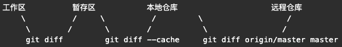

# git simple guide
## 简单介绍 
一段代码的提交顺序：
```
工作区  ->  git add .  -> 暂存区 -> git commit -> 本地仓库 -> git push -> 远程仓库
```
这里就要提到 Git 中的`四个区`：

- 工作区 working
- 暂存区 stage
- 本地仓库 local repository
- 远程仓库 remote repository

被追踪的文件，在未进入和进入上述四个区之后分别有一个状态，所以一共有`五个状态`：

- 未修改 origin
- 已修改 modified
- 已暂存 staged
- 已提交 committed
- 已推送 pushed
---
## 初始化
### 创建新仓库
创建新文件夹，`cd` 进入，执行
```
git init
``` 
### 克隆仓库
执行如下命令以创建一个本地仓库的克隆版本：
```
git clone /one/more/repository
```
如果是远端服务器上的仓库，你的命令会是这个样子：
```
git clone git@github.com:sweetpotatoman/learngit.git
```
---
## 123
### 工作流
你的本地仓库由 git 维护的三棵“树”组成
- 第一个是你的 `工作目录`，它持有实际文件
- 第二个是 `暂存区（Index）`，它像个缓存区域，临时保存你的改动
- 最后是 `HEAD`，它指向你最后一次提交的结果


### 添加和提交 `(add & commit)`
你可以提出更改（把它们添加到暂存区），使用如下命令:
```
git add <filename>
git add *
git add .
```
这是 git 基本工作流程的第一步；使用如下命令以实际提交改动：
```
git commit -m "代码提交信息"
```
现在，你的改动已经提交到了 `HEAD`，但是还没到你的远端仓库。

### 推送改动
你的改动现在已经在本地仓库的 `HEAD` 中了。执行如下命令以将这些改动提交到远端仓库：
```
git push origin <branch>
```
如果你还没有克隆现有仓库，并欲将你的仓库连接到某个远程服务器，你可以使用如下命令添加：
```
git remote add origin <server>
```
如此你就能够将你的改动推送到所添加的服务器上去了

### 分支
分支是用来将特性开发绝缘开来的。在你创建仓库的时候，`master` 是 `“默认的”` 分支。在其他分支上进行开发，完成后再将它们合并到主分支上。


创建一个叫做“feature_x”的分支，并切换过去:
```
git checkout -b feature_x
```
切换回主分支：
```
git checkout master
```
再把新建的分支`删掉`：
```
git branch -d feature_x
```
除非你将分支推送到`远端仓库`，不然该分支就是 不为他人所见的：
```
git push origin <branch>
```

### 更新与合并
要更新你的本地仓库至最新改动，执行：
```
git pull
```
在你的工作目录中 获取`（fetch）` 并 `合并（merge）` 远端的改动。  

要合并其他分支到你的当前分支（例如 master），执行：
```
git merge <branch>
```
在这两种情况下，git 都会尝试去自动合并改动。遗憾的是，这可能并非每次都成功，并可能出现`冲突（conflicts）`。 这时候就需要你修改这些文件来手动合并这些`冲突（conflicts）`。改完之后，你需要执行如下命令以将它们标记为合并成功：
```
git add <filename>
```
在合并改动之前，你可以使用如下命令预览差异：
```
git diff <source_branch> <target_branch>
```

### 标签
为软件发布创建标签是推荐的。这个概念早已存在，在 SVN 中也有。  
你可以执行如下命令创建一个叫做 1.0.0 的标签：
```
git tag 1.0.0 2b123jl12f
```
`2b123jl12f` 是你想要标记的提交 ID 的前 10 位字符。可以使用下列命令获取提交 ID：
```
git log
```
你也可以使用少一点的提交 ID 前几位，只要它的指向具有`唯一性`

### 日志
如果你想了解本地仓库的历史记录，最简单的命令就是使用: 
```
git log
```
你可以`添加一些参数`来修改他的输出，从而得到自己想要的结果。 只看某一个人的提交记录:
```
git log --author=bob
```
一个压缩后的每一条提交记录只占一行的输出:
```
git log --pretty=oneline
```
或者你想通过 `ASCII` 艺术的树形结构来展示所有的分支, 每个分支都标示了他的名字和标签: 
```
git log --graph --oneline --decorate --all
```
看看哪些文件改变了: 
```
git log --name-status
```

### 替换本地改动
假如你操作失误（当然，这最好永远不要发生），你可以使用如下命令替换掉本地改动：
```
git checkout -- <filename>
```
此命令会使用 HEAD 中的最新内容替换掉你的工作目录中的文件。已添加到暂存区的改动以及新文件都不会受到影响。

假如你想丢弃你在本地的所有改动与提交，可以到服务器上获取最新的版本历史，并将你本地主分支指向它：
```
git fetch origin
git reset --hard origin/master
```


---
## 回退
### git diff
- 直接使用 git diff 命令，能够查看已修改，未暂存的内容

- 使用 git diff --cache 来查看已暂存，未提交的内容

- 使用 git diff origin/master master 来查看已提交，未推送的差异。

    

### 撤销`工作区`修改
如果只是在编辑器中修改了文件的内容，还**未使用** `git add` 将修改提交到暂存区，那么可以使用 `git checkout .` 或者 `git checkout -- <file>` 来丢弃本地全部修改或者丢弃某文件的修改。

### 撤销`暂存区`修改
如果已经执行了 `git add`，意味着暂存区中已经有了修改，但是需要丢弃暂存区的修改，那么可以执行 `git reset`  

对于已经被 Git 追踪的文件，可以使用 
```
git reset <file>
```
来单独将文件从暂存区中丢弃，将修改放到工作区。

对于从来没有被 Git 追踪过，是 new file 的文件，则需要使用：
```
git reset HEAD <file>
```
来将新文件从暂存区中取出放到工作区。
如果确定暂存区中的修改完全不需要，则可以使用
```
git reset --hard
```
直接将修改抛弃，**谨慎使用** `–hard` 命令， 暂存区中所有修改都会被丢弃。修改内容也不会被重新放到工作区。

### 撤销本地提交
对于已经本地的提交，也就是使用 git add 并且执行了 git commit 的修改，这时候本地的修改已经进入了本地仓库，而这是需要撤销这一次提交，或者本地的多次提交，
```
git reset --hard origin/master
```
同样还是 `git reset` 命令，但是多了 `origin/master` ，`origin` 表示**远端仓库**的名字，默认为 `origin`，可能也有其他自己的名字，`origin/master` 表示**远程仓库**，既然本地的修改已经不再需要，那么从远端将代码拉回来就行。

不过不建议直接使用 `git reset --hard origin/master` 这样太强的命令，如果想要撤销本地最近的**一次提交**，可以使用
```
git reset --soft HEAD~1
```
这行命令表示，将最近一次提交 `HEAD~1` 从本地仓库回退到暂存区，`--soft` 不会丢弃修改，而是将修改放到暂存区，**后续继续修改**，或者丢弃暂存区的修改就可以随意了。  
如果要撤销本地两次修改，则改成 `HEAD~2` 即可，其他同类。